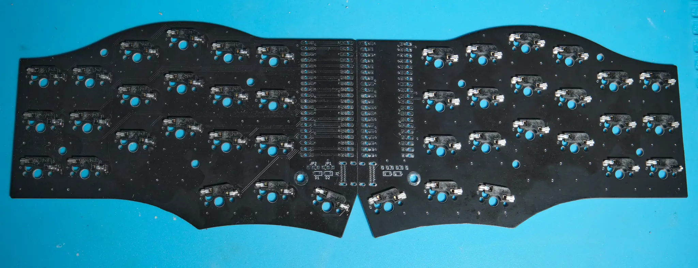
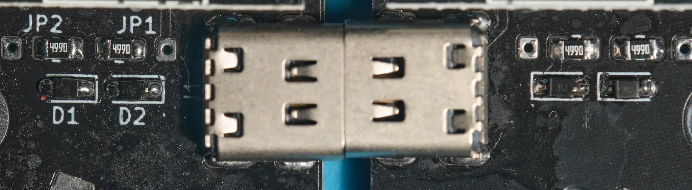
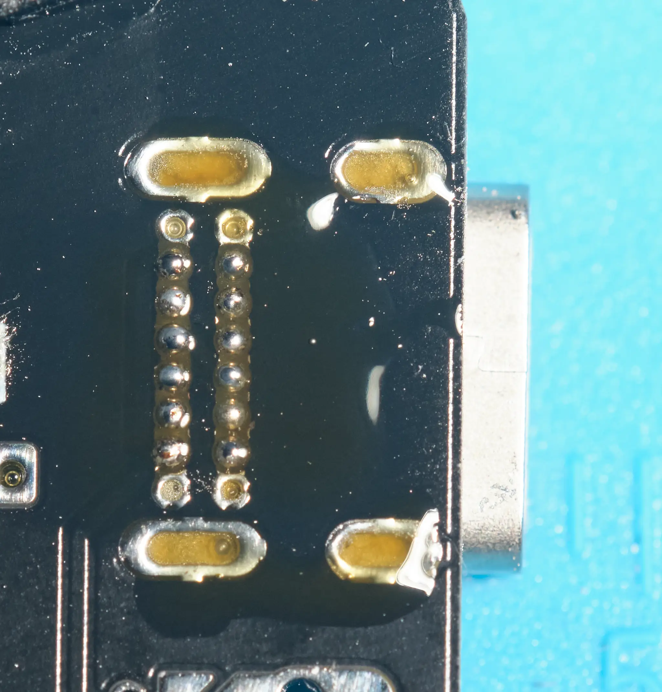
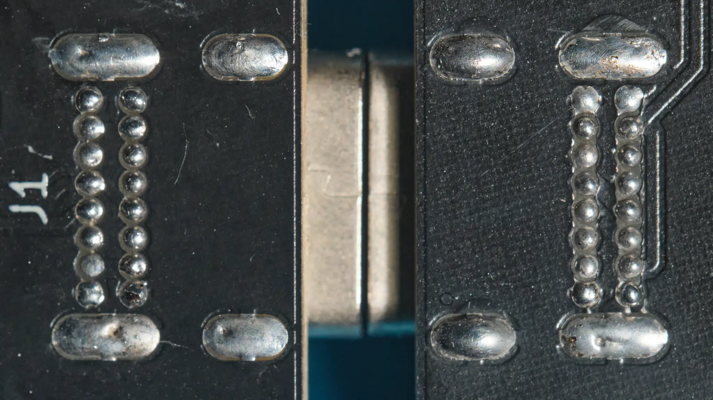
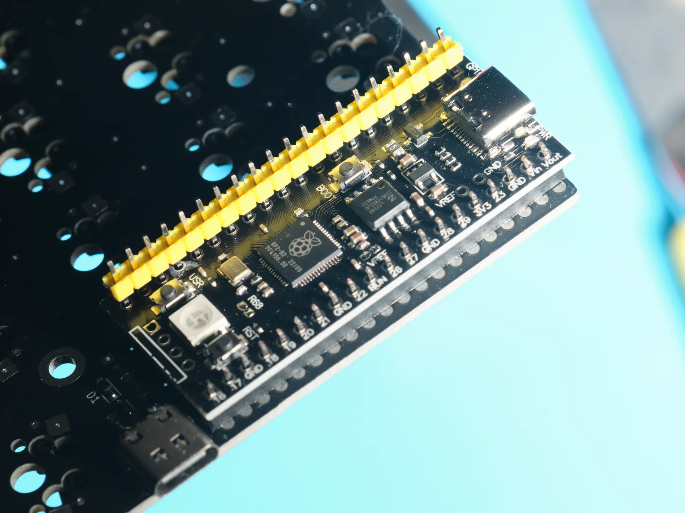
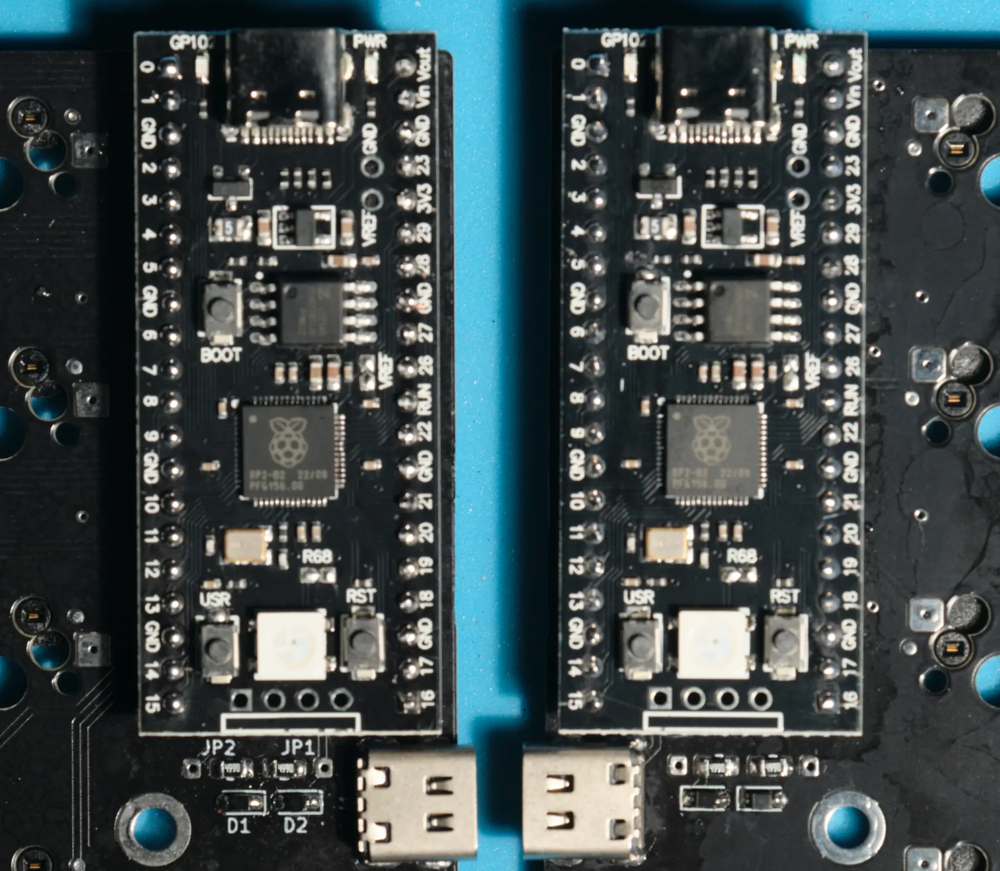
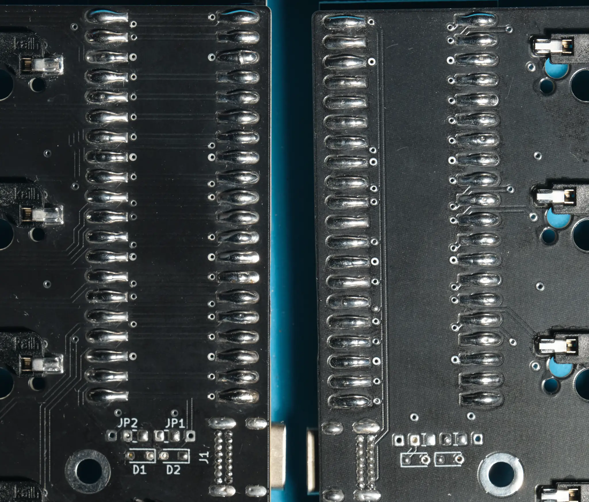
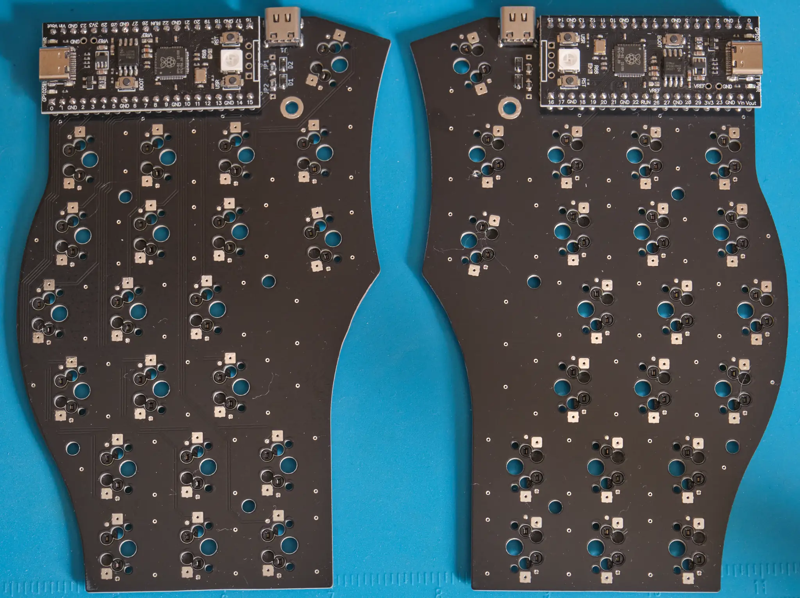
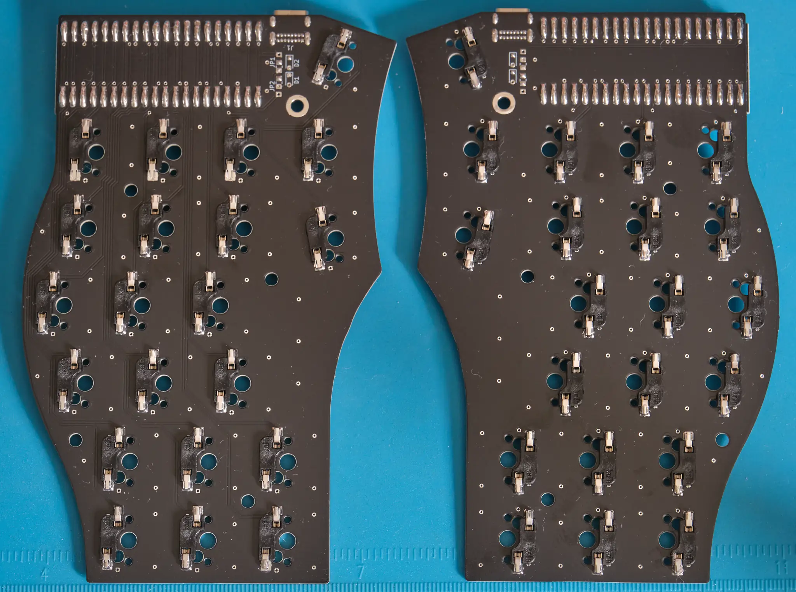

## BOM

- 2 PCBs - necessary
- 2 Pico-like MCU boards - necessary
- 2 [USB-C TH connectors](https://www.aliexpress.com/item/4001044452764.html) - necessary
- 42 Kailh or Gateron MX sockets - necessary
- 2 0805 resistors - optional
- 2 323 protection devices - optional
- 4 20 pin sockets - optional

## PSBs
Everything is straightforward.

First, solder the MX sockets.

Then, solder protection circuit. You need TVS/ESD protection for 3.3V data
lines (I use the UCLAMP3301D) and some 0805 resistors. Their value is not very
important. Everything small enough, let’s say from 200 to 2k, should be fine.
You can skip this step, since the USB-C is a much safer connector than the
usual TRRS. If you decide to do so, just put jumpers instead of the resistors.
The white lines mark the default placement for the resistors/jumpers. Do not
forget about protection devices’ polarity as well.

Solder the USB-C connector. Its “legs” may be too short for a thick PCBs, but
this is not a big issue. I fill the holes with soldering paste and then solder
“non-ground” part of the connector with a soldering iron. Good flux is your
best friend here! After that, use a slightly overheated iron for the ground
part of the connector, since the connector and copper pour suck a lot of heat.

This is how it should look like in the end. This type of connection is very
safe and robust.

Then solder your MCU boards. The “official” case is designed for the 3.5 mm
sockets, but you can use whatever you like, of course, or no sockets at all.

This is how it should look like from the top. 

On the bottom, and on the bottom only, close the jumpers. Conical bent type
tips are particularly useful for it.

Now it is time to clean everything up.

## Firmware

At the moment, only [KMK](https://kmkfw.io/) is supported since it is what I
use. I will add QMK support soon.

- Drag and drop [CircuitPyton for the Pico](https://circuitpython.org/board/raspberry_pi_pico/).
  [Official guide](https://learn.adafruit.com/welcome-to-circuitpython/installing-circuitpython).
- Copy the kmk directory from the [official repo](https://github.com/KMKfw/kmk_firmware) to 
    the CIRCUITPY “flash drive”.
- Copy kb.py and main.py from [this repo](../kmk/) to the same place.
- Then rename the “drives” as “DEDR” for the right half and “DEDL” for the left
    half.

The keyboard should work, but its configuration is beyond the scope of
this guide. Follow the official documentation for KMK and CP.

## Case

I provide an “official“ case for this keyboard. It is a straightforward print,
but the frame around the MCU board is susceptible to warping, so use
warp-preventing settings in your slicer, or even a brim. It is better to be
safe than sorry. The MCU cover is optional. Glue it to the top case if you want
to use it.
